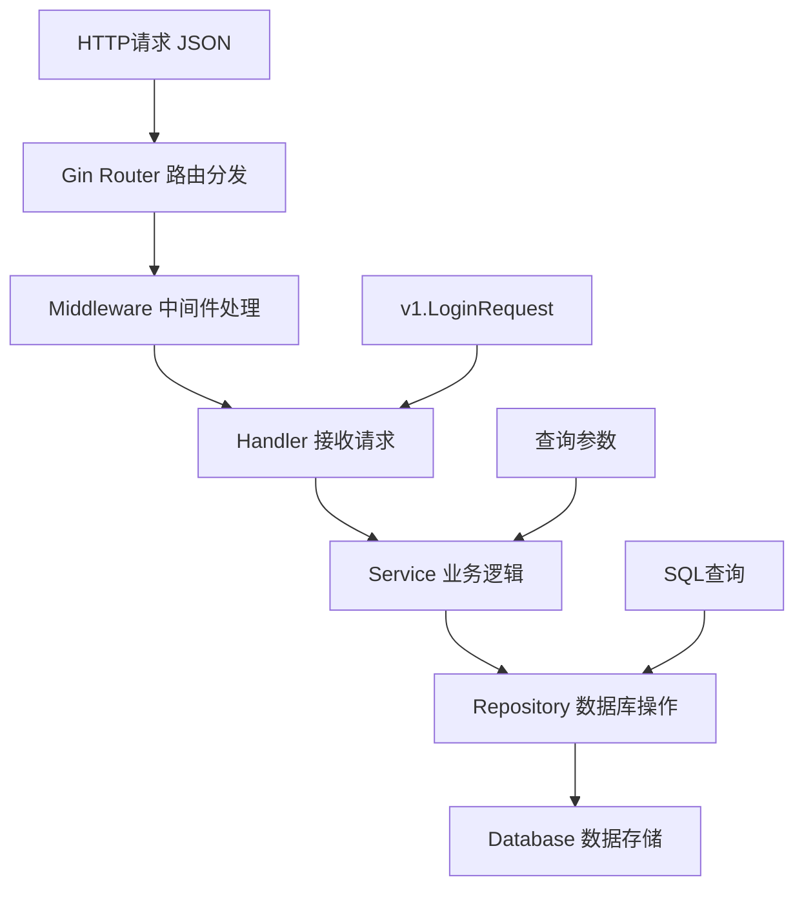
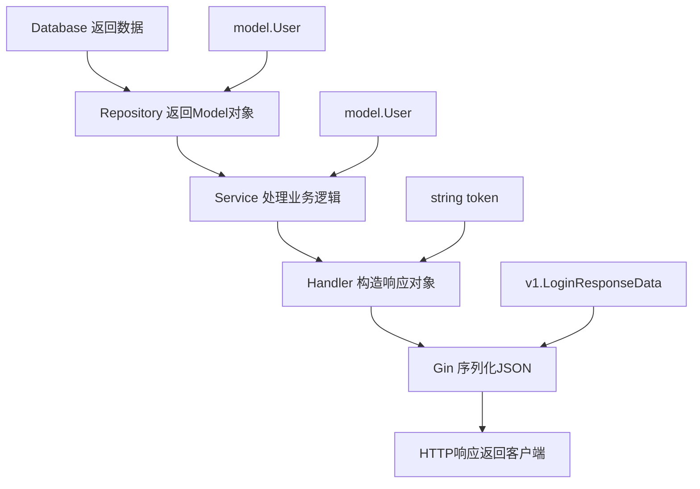

# Go-Site 项目业务开发流程说明

## 目录

- [项目整体架构](#项目整体架构)
- [数据流转详细流程](#数据流转详细流程)
- [完整的请求响应流程](#完整的请求响应流程)
- [关键组件说明](#关键组件说明)
- [业务开发流程](#业务开发流程)
- [代码示例](#代码示例)

## 项目整体架构

本项目采用**分层架构**设计模式，遵循DDD（领域驱动设计）理念，主要分为以下几层：

```text
┌─────────────────┐
│   请求层 (API)   │  ← HTTP请求入口，路由分发
├─────────────────┤
│  处理层 (Handler) │  ← 请求处理，参数验证，响应构造
├─────────────────┤
│  服务层 (Service) │  ← 核心业务逻辑，事务管理
├─────────────────┤
│ 仓储层 (Repository)│  ← 数据访问抽象，数据库操作
├─────────────────┤
│  数据层 (Model)   │  ← 数据模型定义，实体映射
└─────────────────┘
```

### 目录结构说明

```text
go-site/
├── api/v1/                    # API接口定义层
│   ├── user.go               # 用户相关请求/响应结构
│   ├── category.go           # 分类相关结构
│   └── v1.go                 # 通用响应处理
├── cmd/server/               # 应用启动入口
│   ├── main.go              # 主函数
│   └── wire/                # 依赖注入配置
├── internal/                # 核心业务代码
│   ├── handler/             # 处理层
│   ├── service/             # 服务层
│   ├── repository/          # 仓储层
│   ├── model/               # 数据模型层
│   ├── middleware/          # 中间件
│   └── server/              # 服务器配置
├── pkg/                     # 公共工具包
│   ├── config/              # 配置管理
│   ├── db/                  # 数据库连接
│   ├── jwt/                 # JWT工具
│   └── log/                 # 日志工具
└── config/                  # 配置文件
```

## 数据流转详细流程

### 以用户登录为例的完整流程

#### 1. 请求进入阶段

```text
HTTP POST /v1/login
    ↓
Gin Router (router.go)
    ↓
Middleware处理 (cors.go, log.go)
    ↓
UserHandler.Login()
```

#### 2. Handler层处理 (internal/handler/user.go)

```go
func (h *UserHandler) Login(ctx *gin.Context) {
    // 1. 参数绑定和验证
    var req v1.LoginRequest
    if err := ctx.ShouldBindJSON(&req); err != nil {
        v1.HandleError(ctx, http.StatusBadRequest, v1.ErrBadRequest, nil)
        return
    }

    // 2. 调用Service层
    token, err := h.userService.Login(ctx, &req)
    if err != nil {
        v1.HandleError(ctx, http.StatusUnauthorized, v1.ErrLoginFailed, nil)
        return
    }
    
    // 3. 返回响应
    v1.HandleSuccess(ctx, v1.LoginResponseData{
        AccessToken: token,
    })
}
```

**Handler层职责：**

- 请求参数绑定与验证
- 调用Service层业务逻辑
- 构造响应结果 
- 错误处理和状态码设置

#### 3. Service层处理 (internal/service/user.go)

```go
func (s *userService) Login(ctx context.Context, req *v1.LoginRequest) (string, error) {
    // 1. 调用Repository层获取用户
    user, err := s.userRepo.GetByUsername(ctx, req.Username)
    if err != nil || user == nil {
        return "", v1.ErrLoginFailed
    }

    // 2. 业务逻辑处理（密码验证）
    err = bcrypt.CompareHashAndPassword([]byte(user.Password), []byte(req.Password))
    if err != nil {
        return "", err
    }

    // 3. 生成JWT Token
    token, err := s.jwt.GenToken(
        strconv.FormatInt(int64(user.Id), 10), 
        time.Now().Add(time.Hour*24*1)
    )
    
    return token, nil
}
```

**Service层职责：**

- 核心业务逻辑实现
- 数据验证和转换
- 调用Repository进行数据操作
- 事务管理
- 第三方服务集成

#### 4. Repository层处理 (internal/repository/user.go)

```go
func (r *userRepository) GetByUsername(ctx context.Context, username string) (*model.User, error) {
    var user model.User
    // GORM数据库查询
    if err := r.DB(ctx).Where("username = ?", username).First(&user).Error; err != nil {
        if errors.Is(err, gorm.ErrRecordNotFound) {
            return nil, nil
        }
        return nil, err
    }
    return &user, nil
}
```

**Repository层职责：**

- 数据库操作封装
- SQL查询构建
- 数据持久化
- 事务支持
- 缓存策略（如适用）

#### 5. Model层 (internal/model/user.go)

```go
type User struct {
    BaseModel                 // 基础字段(ID, 创建时间等)
    Username string  `json:"username" gorm:"unique;not null"`
    Nickname *string `json:"nickname" gorm:"type:varchar(100); default:''"`
    Password string  `json:"-" gorm:"not null"`          // json:"-" 不返回密码
    Status   int     `json:"status" gorm:"not null; type:tinyint(1); default:1"`
}
```

**Model层职责：**

- 数据结构定义
- 数据库字段映射
- 数据验证规则
- JSON序列化控制

## 完整的请求响应流程

### 请求阶段数据流转



### 响应阶段数据流转



### 数据格式转换过程

```text
Input:  {"username": "admin", "password": "123456"}
         ↓ (Handler)
Step1:  v1.LoginRequest{Username: "admin", Password: "123456"}
         ↓ (Service)
Step2:  查询条件: WHERE username = 'admin'
         ↓ (Repository)
Step3:  model.User{Id: 1, Username: "admin", Password: "hash..."}
         ↓ (Service)
Step4:  JWT Token: "eyJhbGciOiJIUzI1NiIs..."
         ↓ (Handler)
Output: {"code": 0, "message": "success", "data": {"accessToken": "eyJ..."}}
```

## 关键组件说明

### 1. 依赖注入 (Wire)

**文件位置**: `cmd/server/wire/wire.go`

```go
// 定义依赖注入规则
var repositorySet = wire.NewSet(
    repository.NewDB,
    repository.NewRepository,
    repository.NewUserRepository,
    // ...
)

var serviceSet = wire.NewSet(
    service.NewService,
    service.NewUserService,
    // ...
)
```

**作用**:

- 管理组件间依赖关系
- 实现控制反转(IoC)
- 编译时依赖检查
- 避免手动创建对象

#### Wire 使用时机和完整流程

**何时使用 Wire：**

```text
开发阶段           使用 Wire 的时机                触发条件
─────────────────────────────────────────────────────────
1. 初始搭建     │  项目架构搭建完成后           │  基础组件都已定义
2. 新增功能     │  Repository/Service 实现后    │  有新的依赖关系
3. 重构代码     │  依赖关系发生变化后           │  修改了构造函数
4. 调试问题     │  依赖注入报错时               │  编译或运行错误
```

**标准开发流程中的 Wire 集成点：**

##### 阶段1：基础组件完成后 (首次使用)

```text
完成顺序：Model → Repository → Service → Handler → 配置 Wire
```

```go
// 1. 完成基础模型定义 (internal/model/user.go)
type User struct {
    BaseModel
    Username string `json:"username" gorm:"unique;not null"`
    // ...
}

// 2. 完成Repository接口和实现 (internal/repository/user.go)
func NewUserRepository(r *Repository) UserRepository {
    return &userRepository{Repository: r}
}

// 3. 完成Service接口和实现 (internal/service/user.go)
func NewUserService(s *Service, userRepo repository.UserRepository) UserService {
    return &userService{Service: s, userRepo: userRepo}
}

// 4. 完成Handler实现 (internal/handler/user.go)  
func NewUserHandler(userService service.UserService) *UserHandler {
    return &UserHandler{userService: userService}
}

// 5. 配置Wire依赖注入 (cmd/server/wire/wire.go)
var repositorySet = wire.NewSet(
    repository.NewUserRepository,  // 新增
    // ...existing...
)

var serviceSet = wire.NewSet(
    service.NewUserService,        // 新增
    // ...existing...
)
```

##### 阶段2：每次新增功能时 (增量使用)

**触发时机**：完成新功能的 Repository 和 Service 实现后

```go
// 例如：新增天气服务

// 1. 实现 WeatherRepository
func NewWeatherRepository(db *gorm.DB, logger *log.Logger) WeatherRepository {
    return &weatherRepository{db: db, logger: logger}
}

// 2. 实现 WeatherService  
func NewWeatherService(s *Service, weatherRepo repository.WeatherRepository) WeatherService {
    return &weatherService{Service: s, weatherRepo: weatherRepo}
}

// 3. 立即更新 Wire 配置
var repositorySet = wire.NewSet(
    // ...existing...
    repository.NewWeatherRepository,  // 新增这行
)

var serviceSet = wire.NewSet(
    // ...existing...
    service.NewWeatherService,        // 新增这行
)

// 4. 运行 Wire 生成代码
```

**命令执行：**

```bash
# 进入 wire 目录
cd cmd/server/wire

# 生成依赖注入代码
wire

# 验证生成结果
ls -la wire_gen.go
```

##### 阶段3：Wire 工作原理和生成的代码

**Wire 配置文件结构：**

```go
// cmd/server/wire/wire.go
//go:build wireinject
// +build wireinject

package wire

// 1. 定义依赖集合
var repositorySet = wire.NewSet(
    repository.NewDB,           // 数据库连接
    repository.NewRedis,        // Redis连接  
    repository.NewRepository,   // 基础Repository
    repository.NewTransaction,  // 事务管理
    repository.NewUserRepository,      // 用户Repository
    repository.NewWeatherRepository,   // 天气Repository
)

var serviceSet = wire.NewSet(
    service.NewService,         // 基础Service
    service.NewUserService,     // 用户Service
    service.NewWeatherService,  // 天气Service
)

var handlerSet = wire.NewSet(
    handler.NewHandler,         // 统一Handler
)

// 2. 定义最终的构建函数
func NewWire(*viper.Viper, *log.Logger) (*app.App, func(), error) {
    panic(wire.Build(
        repositorySet,  // 注入Repository层
        serviceSet,     // 注入Service层
        handlerSet,     // 注入Handler层
        jobSet,         // 注入Job层
        serverSet,      // 注入Server层
        sid.NewSid,     // 注入ID生成器
        jwt.NewJwt,     // 注入JWT工具
        newApp,         // 最终的App构造函数
    ))
}
```

**生成的代码示例 (wire_gen.go)：**

```go
// Code generated by Wire. DO NOT EDIT.
func NewWire(viperViper *viper.Viper, logger *log.Logger) (*app.App, func(), error) {
    // 1. 创建基础组件
    jwtJWT := jwt.NewJwt(viperViper)
    db := repository.NewDB(viperViper, logger)
    client := repository.NewRedis(viperViper)
    
    // 2. 创建Repository层 (自动解析依赖关系)
    repositoryRepository := repository.NewRepository(logger, db, client)
    transaction := repository.NewTransaction(repositoryRepository)
    userRepository := repository.NewUserRepository(repositoryRepository)
    weatherRepository := repository.NewWeatherRepository(db, logger)
    
    // 3. 创建Service层 (自动注入Repository依赖)
    sidSid := sid.NewSid()
    serviceService := service.NewService(transaction, logger, sidSid, jwtJWT, client)
    userService := service.NewUserService(serviceService, userRepository)
    weatherService := service.NewWeatherService(serviceService, weatherRepository)
    
    // 4. 创建Handler层 (自动注入Service依赖)
    handlerHandler := handler.NewHandler(logger, userService, weatherService, ...)
    
    // 5. 创建Server和App
    router := server.ProvideRouter(handlerHandler, jwtJWT, logger, viperViper)
    httpServer := server.NewHTTPServer(logger, viperViper, jwtJWT, router)
    appApp := newApp(httpServer, jobServer, viperViper)
    
    return appApp, func() {}, nil
}
```

##### 阶段4：实际开发中的 Wire 使用节奏

**日常开发节奏：**

```text
1. 编写业务代码 (Model/Repository/Service/Handler)
   ↓
2. 实现构造函数 (NewXxxRepository, NewXxxService)
   ↓  
3. 更新 Wire 配置 (添加到对应的 Set)
   ↓
4. 运行 wire 命令生成代码
   ↓
5. 编译运行验证
   ↓
6. 如有依赖错误，回到步骤1修正
```

##### 完整示例：开发用户管理功能

```bash
# 第1步：编写基础代码
vim internal/model/user.go           # 定义User模型
vim internal/repository/user.go      # 实现UserRepository
vim internal/service/user.go         # 实现UserService  
vim internal/handler/user.go         # 实现UserHandler

# 第2步：更新Wire配置
vim cmd/server/wire/wire.go          # 添加依赖注入规则

# 第3步：生成依赖注入代码
cd cmd/server/wire
wire                                 # 生成wire_gen.go

# 第4步：验证和测试
cd ../../../
go build cmd/server/main.go         # 编译检查
go run cmd/server/main.go            # 运行测试
```

##### 阶段5：Wire 最佳实践

**1. Set 组织原则：**

```go
// 按照架构层次分组
var repositorySet = wire.NewSet(/* Repository层相关 */)
var serviceSet = wire.NewSet(/* Service层相关 */)
var handlerSet = wire.NewSet(/* Handler层相关 */)

// 按照功能模块分组 (可选的补充方式)
var userModuleSet = wire.NewSet(
    repository.NewUserRepository,
    service.NewUserService,
)
```

**2. 依赖错误处理：**

```bash
# 常见错误1：循环依赖
# 错误信息：cycle detected in dependency graph
# 解决：检查Service之间是否存在相互依赖

# 常见错误2：缺少提供者
# 错误信息：no provider found for xxx
# 解决：确保所有依赖都在相应的Set中声明

# 常见错误3：参数不匹配
# 错误信息：provider returns xxx but injection requires yyy  
# 解决：检查构造函数的参数和返回值类型
```

**3. 开发工作流：**

```bash
# 监控Wire文件变化，自动重新生成 (可选)
find cmd/server/wire -name "*.go" ! -name "*_gen.go" | entr wire

# 验证生成的代码
cd cmd/server/wire && wire && cd - && go build cmd/server/main.go
```

#### Wire 在完整开发流程中的位置

```texttext
业务开发标准流程：

1. 定义API接口 (api/v1/)
2. 创建数据模型 (internal/model/) 
3. 实现Repository层 (internal/repository/)
4. 实现Service层 (internal/service/)  
5. 实现Handler层 (internal/handler/)
6. 注册路由 (internal/server/router.go)
7. ★ 配置依赖注入 (cmd/server/wire/wire.go) ← Wire使用点
8. ★ 生成依赖代码 (运行wire命令)         ← Wire执行点
9. 测试验证

关键点：Wire 在步骤7-8，即所有组件实现完成后使用
```

**总结**：Wire 不是在某个单一时机使用，而是贯穿整个开发过程的工具。每当你添加新的组件或修改依赖关系时，都需要更新 Wire 配置并重新生成代码。这确保了依赖注入的正确性和项目的可编译性。

### 2. API定义层

**文件位置**: `api/v1/` 目录

```go
// 请求结构
type LoginRequest struct {
    Username string `json:"username" binding:"required"`
    Password string `json:"password" binding:"required"`
}

// 响应结构
type LoginResponseData struct {
    AccessToken string `json:"accessToken"`
}
```

**作用**:

- 统一API接口定义
- 请求参数验证
- 响应格式标准化
- API文档生成支持

### 3. 中间件系统

**文件位置**: `internal/middleware/` 目录

```go
// JWT认证中间件
func StrictAuth(j *jwt.JWT, logger *log.Logger) gin.HandlerFunc {
    return func(ctx *gin.Context) {
        tokenString := ctx.Request.Header.Get("Authorization")
        if tokenString == "" {
            v1.HandleError(ctx, http.StatusUnauthorized, v1.ErrUnauthorized, nil)
            ctx.Abort()
            return
        }
        // Token验证逻辑...
    }
}
```

**功能模块**:

- **jwt.go**: JWT认证
- **cors.go**: 跨域处理
- **log.go**: 请求日志
- 可扩展其他横切关注点

### 4. 配置管理

**文件位置**: `pkg/config/` 和 `config/` 目录

```yaml
# config/dev.yml
server:
  port: 8000
database:
  host: localhost
  port: 3306
  username: root
  # ...
```

**特性**:

- 多环境配置支持
- 配置验证机制
- 热重载支持
- 敏感信息保护

## 业务开发流程

### 开发新功能的标准步骤

#### 1. 定义API接口 (api/v1/)

```go
// 1. 创建请求结构
type CreateUserRequest struct {
    Username string `json:"username" binding:"required"`
    Email    string `json:"email" binding:"required,email"`
}

// 2. 创建响应结构
type CreateUserResponse struct {
    Response
    Data UserData `json:"data"`
}
```

#### 2. 创建数据模型 (internal/model/)

```go
type User struct {
    BaseModel
    Username string `json:"username" gorm:"unique;not null"`
    Email    string `json:"email" gorm:"unique;not null"`
    // 其他字段...
}
```

#### 3. 实现Repository层 (internal/repository/)

```go
type UserRepository interface {
    Create(ctx context.Context, user *model.User) error
    GetByEmail(ctx context.Context, email string) (*model.User, error)
    // 其他方法...
}

func (r *userRepository) Create(ctx context.Context, user *model.User) error {
    return r.DB(ctx).Create(user).Error
}
```

#### 4. 实现Service层 (internal/service/)

```go
type UserService interface {
    CreateUser(ctx context.Context, req *v1.CreateUserRequest) error
    // 其他方法...
}

func (s *userService) CreateUser(ctx context.Context, req *v1.CreateUserRequest) error {
    // 业务逻辑实现
    user := &model.User{
        Username: req.Username,
        Email:    req.Email,
    }
    return s.userRepo.Create(ctx, user)
}
```

#### 5. 实现Handler层 (internal/handler/)

```go
func (h *UserHandler) CreateUser(ctx *gin.Context) {
    var req v1.CreateUserRequest
    if err := ctx.ShouldBindJSON(&req); err != nil {
        v1.HandleError(ctx, http.StatusBadRequest, v1.ErrBadRequest, err.Error())
        return
    }

    if err := h.userService.CreateUser(ctx, &req); err != nil {
        v1.HandleError(ctx, http.StatusInternalServerError, err, nil)
        return
    }

    v1.HandleSuccess(ctx, nil)
}
```

#### 6. 注册路由 (internal/server/router.go)

```go
func (r *Router) Register(e *gin.Engine) {
    v1 := e.Group("/v1")
    {
        // 公开路由
        v1.POST("register", r.handlers.UserHandler.Register)
        v1.POST("login", r.handlers.UserHandler.Login)
        
        // 需要认证的路由
        auth := v1.Group("").Use(middleware.StrictAuth(r.jwt, r.logger))
        {
            auth.POST("users", r.handlers.UserHandler.CreateUser)
            auth.GET("user", r.handlers.UserHandler.GetProfile)
        }
    }
}
```

#### 7. 配置依赖注入 (cmd/server/wire/wire.go)

```go
var serviceSet = wire.NewSet(
    service.NewService,
    service.NewUserService,
    // 添加新的Service
)

var handlerSet = wire.NewSet(
    handler.NewHandler,
    handler.NewUserHandler,
    // 添加新的Handler
)
```

## 代码示例

### 完整的CRUD操作示例

#### Repository层

```go
func (r *userRepository) List(ctx context.Context, req v1.GetAllUsersRequest) ([]model.User, error) {
    var users []model.User
    query := r.DB(ctx)
    
    // 动态查询条件
    if req.Username != "" {
        query = query.Where("username LIKE ?", "%"+req.Username+"%")
    }
    
    // 分页
    offset := (req.Page - 1) * req.PageSize
    if err := query.Offset(offset).Limit(req.PageSize).Find(&users).Error; err != nil {
        return nil, err
    }
    
    return users, nil
}
```

#### Service层

```go
func (s *userService) GetAllUsers(ctx context.Context, req v1.GetAllUsersRequest) ([]model.User, error) {
    // 业务逻辑验证
    if req.PageSize <= 0 || req.PageSize > 100 {
        req.PageSize = 10 // 默认分页大小
    }
    
    return s.userRepo.List(ctx, req)
}
```

#### Handler层

```go
func (h *UserHandler) GetAllUsers(ctx *gin.Context) {
    var req v1.GetAllUsersRequest
    if err := ctx.ShouldBindQuery(&req); err != nil {
        v1.HandleError(ctx, http.StatusBadRequest, v1.ErrBadRequest, err.Error())
        return
    }

    users, err := h.userService.GetAllUsers(ctx, req)
    if err != nil {
        v1.HandleError(ctx, http.StatusInternalServerError, err, nil)
        return
    }

    v1.HandleSuccess(ctx, users)
}
```

## 最佳实践

### 1. 错误处理

```go
// 统一错误定义
var (
    ErrUserNotFound = errors.New("用户不存在")
    ErrInvalidPassword = errors.New("密码错误")
)

// 错误传播
func (s *userService) Login(ctx context.Context, req *v1.LoginRequest) (string, error) {
    user, err := s.userRepo.GetByUsername(ctx, req.Username)
    if err != nil {
        return "", fmt.Errorf("获取用户信息失败: %w", err)
    }
    if user == nil {
        return "", ErrUserNotFound
    }
    // ...
}
```

### 2. 事务管理

```go
func (s *userService) Register(ctx context.Context, req *v1.RegisterRequest) error {
    return s.tm.Transaction(ctx, func(ctx context.Context) error {
        // 创建用户
        if err := s.userRepo.Create(ctx, user); err != nil {
            return err
        }
        
        // 创建用户配置
        if err := s.userConfigRepo.Create(ctx, config); err != nil {
            return err
        }
        
        return nil
    })
}
```

### 3. 日志记录

```go
func (h *UserHandler) Login(ctx *gin.Context) {
    h.logger.WithContext(ctx).Info("用户登录请求", 
        zap.String("username", req.Username),
        zap.String("ip", ctx.ClientIP()),
    )
    
    token, err := h.userService.Login(ctx, &req)
    if err != nil {
        h.logger.WithContext(ctx).Error("登录失败", 
            zap.Error(err),
            zap.String("username", req.Username),
        )
        // ...
    }
}
```

## 开发工具和命令

### 常用开发命令

```bash
# 启动开发服务器
go run cmd/server/main.go -conf ./config/dev.yml

# 生成依赖注入代码
cd cmd/server/wire && wire

# 数据库迁移
go run cmd/migration/main.go

# 运行测试
go test ./...

# 生成API文档
swag init -g cmd/server/main.go
```

### 项目结构检查清单

- [ ] API接口定义完整
- [ ] 数据模型设计合理
- [ ] Repository接口清晰
- [ ] Service业务逻辑正确
- [ ] Handler错误处理完善
- [ ] 路由注册正确
- [ ] 依赖注入配置
- [ ] 单元测试覆盖

## 总结

这种分层架构的核心优势：

1. **职责清晰**: 每一层都有明确的职责边界
2. **易于测试**: 各层可以独立进行单元测试
3. **便于维护**: 修改某一层不会影响其他层
4. **代码复用**: Service层可以被多个Handler复用
5. **扩展性强**: 新增功能只需按照标准流程开发

通过遵循这套开发流程，可以确保代码质量的一致性和项目的可维护性。

---

最后更新: 2025年6月29日
````
